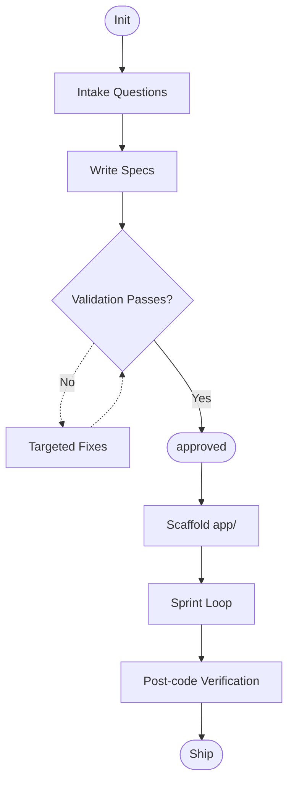

# Spectra

Spectra is a spec-driven development backbone for AI-assisted software projects.
It keeps requirements, decisions, and execution context in structured files so agents can build reliably across sessions.

## What Spectra Is

- A workflow: intake -> specs -> validation -> `approved` -> scaffold -> sprint loop -> verification.
- A structure: rules in `sdd/.agent/`, specs in `sdd/memory-bank/`, code in `app/`.
- A guardrail system: explicit approval gate, validation checks, policy checks, and traceability.

## Who It Is For (And Not For)

Use Spectra if you want:
- AI agents to follow consistent delivery rules.
- Specs-first development with explicit human approval before coding.
- Session-to-session continuity via a persistent memory bank.

Spectra is not optimized for:
- throwaway prototypes where process overhead is undesirable,
- code-first workflows that do not maintain specs,
- teams that do not want approval gates.

## Golden Path

1. Start intake with `init`.
2. Answer phased questions (Core -> Type-specific -> Advanced optional).
3. Agent writes/updates specs under `sdd/memory-bank/`.
4. Run validation and resolve errors.
5. Reply `approved`.
6. Agent scaffolds under `app/`.
7. Agent runs sprint loop: plan -> skill checks -> code -> test -> verify -> update memory bank.
8. Ship with changelog/rollback readiness.

## First 10 Minutes

From repo root:

```bash
# 1) Start intake in your AI agent
init

# 2) Validate repository/rules integrity
bash scripts/validate-repo.sh --strict

# 3) After validation passes and specs look good
# reply in the agent chat:
approved

# 4) Quick health snapshot
bash scripts/health-check.sh
```

Expected outcomes:
- Intake state is tracked in `sdd/memory-bank/core/intake-state.md`.
- No application code is generated before `approved`.
- After `approved`, scaffolding and sprint execution happen under `app/`.

## High-Level Flow



## Repository Layout

```text
sdd/
├── .agent/                # Rules, skills, scaffolds, prompts
└── memory-bank/           # Specs, context, progress, traceability
app/                       # Application code (after approval only)
docs/                      # Guides and examples
scripts/                   # Validation, policy, health, spec diff helpers
```

## Core Commands

| Command | Purpose |
|---|---|
| `bash scripts/validate-repo.sh --strict` | Validate indexes, links, adapter consistency, templates |
| `bash scripts/check-policy.sh` | Enforce approval/progress policy (local default range) |
| `bash scripts/check-policy.sh --base <sha> --head <sha>` | Range-aware policy check for CI/PR validation |
| `bash scripts/health-check.sh` | Quick project health snapshot |
| `bash scripts/spec-diff.sh --update` | Append spec diff report entry |

## Troubleshooting

Validation fails:
- Run `bash scripts/validate-repo.sh --strict`.
- Fix reported errors in listed files.
- Re-run until `Validation: OK`.

Intake interrupted:
- Run `init` again.
- Agent resumes from `sdd/memory-bank/core/intake-state.md`.

Requirements changed after approval:
- Update specs first.
- Record in `sdd/memory-bank/core/spec-history.md`.
- Re-validate.
- If behavioral/mandatory changes exist, re-approve with `approved`.

## Documentation Map

- `docs/quick-start.md` - shortest happy path.
- `docs/overview.md` - principles and lifecycle.
- `docs/getting-started.md` - detailed walkthrough.
- `docs/workflow.md` - resume, sprint loop, discovery, re-approval, rollback.
- `docs/testing.md` - validation and policy test scenarios.
- `docs/spec-merge.md` - safe spec merge patterns.
- `docs/examples/` - intake answer examples by app type.

## Example Intake (Core)

```text
Project name: Customer Orders Service
Purpose: Manage customer orders, payments, and shipment status.
App type: Backend API
Language: Java 21
Framework: Spring Boot 3.2
Architecture: Hexagonal
Data store: PostgreSQL 16
Deployment: Kubernetes
API style: REST
```

## License

MIT — see [`LICENSE`](LICENSE).
