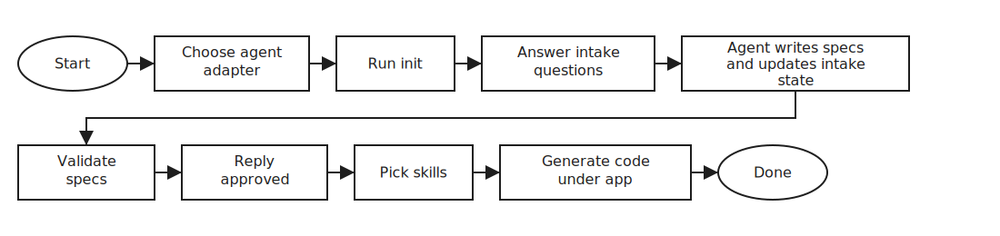
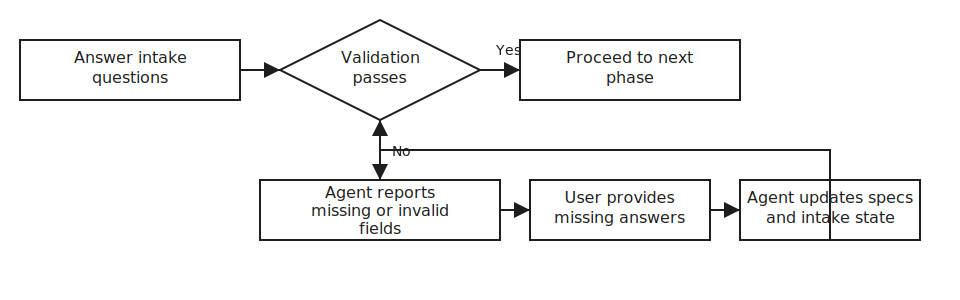
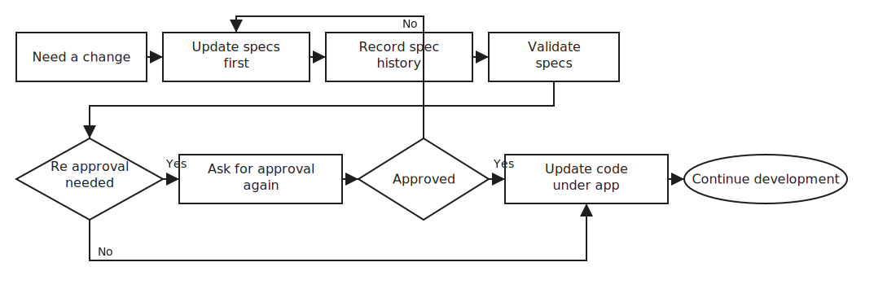

# SDD Spine

A spec-driven development (SDD) backbone that keeps project structure stable while working with AI agents or human-driven workflows.

- Specs live under [`sdd/memory-bank/`](sdd/memory-bank/)
- Agent rules live under [`sdd/.agent/`](sdd/.agent/)
- Application code (after approval) lives under [`app/`](app/)

## Quick Start

1. 🧩 Choose an agent adapter:
   - Codex: [`AGENTS.md`](AGENTS.md)
   - Claude: [`CLAUDE.md`](CLAUDE.md)
   - Cursor: [`.cursorrules`](.cursorrules)
   - Other tools: [`AGENT.md`](AGENT.md)
2. ▶️ In the repo root, run: `init`
3. 📝 Complete intake in phases (Core -> Type-specific -> Optional Advanced).
4. ✅ Fix any validation errors (rules: [`sdd/.agent/rules/intake/02-validation.md`](sdd/.agent/rules/intake/02-validation.md)).
5. 🔒 When validation passes, reply `approved`.
6. 🏗️ After approval, all application code must be generated under `app/` only (see [`app/README.md`](app/README.md)).

> 🔁 Resume: If you stop mid-intake, run `init` again. Progress is tracked in [`sdd/memory-bank/core/intake-state.md`](sdd/memory-bank/core/intake-state.md).

## Workflow Scenarios (Excalidraw)

### Scenario 1: Happy Path

✅ Default path for most projects.



Source: `docs/diagrams/workflow-scenario-1-happy-path.excalidraw`

### Scenario 2: Validation Fails

🔁 When validation fails, the agent should ask only targeted follow ups until the next validation pass.



Source: `docs/diagrams/workflow-scenario-2-validation-fails.excalidraw`

### Scenario 3: Spec Change After Approval

🔄 When requirements change, update specs first, then validate, then update code under `app/`.



Source: `docs/diagrams/workflow-scenario-3-spec-change-after-approval.excalidraw`

For the full walkthrough and edge cases, see:
- [`docs/getting-started.md`](docs/getting-started.md)
- [`docs/workflow.md`](docs/workflow.md)

## Docs

| Doc | Use it for |
| --- | --- |
| [`docs/overview.md`](docs/overview.md) | What this repo is and the core principles |
| [`docs/quick-start.md`](docs/quick-start.md) | Minimal path: init -> validate -> approved |
| [`docs/getting-started.md`](docs/getting-started.md) | Full walkthrough (diagrams are in this README) |
| [`docs/workflow.md`](docs/workflow.md) | Resume, spec changes, re-approval, rollback |
| [`docs/testing.md`](docs/testing.md) | Repo validation and regression scenarios |
| [`docs/spec-merge.md`](docs/spec-merge.md) | How to merge specs safely (conflicts, re-approval) |
| [`docs/multi-project.md`](docs/multi-project.md) | Multi-project and monorepo patterns |
| [`docs/examples/`](docs/examples/) | Copy-paste scenarios for common app types |

## Repo Layout

```text
sdd/       agent rules + memory bank specs
app/       application code (only after approval)
docs/      documentation
scripts/   repo validation helpers
```

## Core Rules

- No application code before explicit approval.
- Update specs first, then validate, then implement.
- Keep all application code under `app/` only.
- If requirements change after approval:
  - update specs
  - record the change in [`sdd/memory-bank/core/spec-history.md`](sdd/memory-bank/core/spec-history.md)
  - follow [`docs/workflow.md`](docs/workflow.md)

## Example Intake (Phase 1)

- Project name: Customer Orders Service
- Primary purpose/goal: Manage customer orders, payments, and shipment status.
- App type: Backend API
- Primary language + version: Java 21
- Framework + version: Spring Boot 3.2
- Architecture style: Hexagonal
- Primary data store + version: PostgreSQL 16
- Deployment target: Kubernetes
- API style: REST
