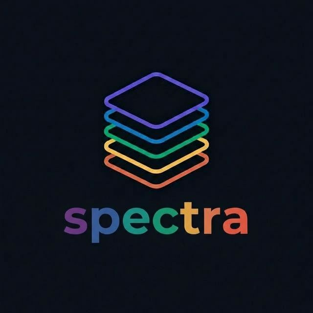

<p align="center">
  
</p>

# Spectra

Spectra is a CLI-first operating system for AI-assisted product development.

<p align="center">
  <a href="https://www.npmjs.com/package/spectra-pack">
    
  </a>
  <a href="https://www.npmjs.com/package/spectra-pack">
    
  </a>
  <a href="LICENSE">
    
  </a>
</p>

The v2 direction is:

1. Define product intent, technical decisions, and AI behavior in specs first.
2. Validate the repo, policy, and approval state.
3. Approve staged checkpoints before execution.
4. Let AI implement, then verify with tests, evals, and release confidence gates.

Spectra is not “just generate code.” It is “turn specs into controlled AI execution.”

## Install With npx

```bash
npx spectra-pack@latest init /path/to/your-project
cd /path/to/your-project
spectra validate
spectra status
```

Already have a repo?

```bash
npx spectra-pack@latest adopt /path/to/your-project
```

## What Spectra Gives You

When Spectra is added to a project, it gives you:

- `spectra` as the CLI entry point
- `packages/core` as the packaged shell runtime
- `packages/templates` as the project scaffolding layer
- `sdd/system/` for workflow rules and runtime policies
- `sdd/features/` for executable feature specs
- `sdd/governance/` for staged approval and decision graph state
- `sdd/memory-bank/` for human-readable context, progress, and long-form notes
- a repo-native runtime without exposing shell scripts to end users

## The Basic Flow

### 1. Bootstrap a new project with the CLI

Published package:

```bash
npx spectra-pack@latest init /path/to/your-project
```

Working from this repository directly:

```bash
node packages/cli/bin/spectra.js init /path/to/your-project

# existing repo? install and run brownfield discovery
node packages/cli/bin/spectra.js adopt /path/to/your-project --agents codex,cursor
```

### 2. Validate and verify through the CLI

```bash
cd /path/to/your-project
spectra validate
spectra status
spectra verify --scope app
```

### 3. Continue the workflow through CLI commands

```bash
spectra task --item TASK-001 --task-type bugfix --goal "Describe intended change"
spectra context --role planner --goal discover
spectra diff update
```

Legacy task aliases such as `spectra context --task bootstrap` still work, but role/goal loading is the preferred token-efficient path.

## Local Development

From this repository root:

```bash
npm install
./node_modules/.bin/spectra validate
./node_modules/.bin/spectra verify --scope spec
```

## Important

- `spectra` is the only user-facing entry point.
- The shell runtime remains internal to the CLI package.
- Spectra should control AI behavior through specs before code is written.

## If Your Repo Already Has Code

Use discovery mode:

```bash
spectra adopt /path/to/your-project
```

This creates discovery notes under `sdd/memory-bank/discovery/`.

Those notes are hints, not final decisions.

## AI Tool Adapters

Spectra can generate optional adapters for:

- `Claude Code`
- `Cursor`
- `Windsurf`
- `GitHub Copilot`
- `Codex`
- `Antigravity`

Generate them with:

```bash
spectra adapters --agents claude,cursor,windsurf,copilot,codex,antigravity --target /path/to/your-project
```

## Project Shape After Install

```text
your-project/
├── .spectra/
├── app/
├── docs/
├── sdd/
│   ├── features/
│   ├── governance/
│   ├── memory-bank/
│   └── system/
```

For a full repo map, read `docs/structure.md`.

## Read Next

- `docs/quick-start.md`
- `docs/structure.md`
- `docs/getting-started.md`
- `docs/workflow.md`
- `CHANGELOG.md`

## License

MIT. See [`LICENSE`](LICENSE).
