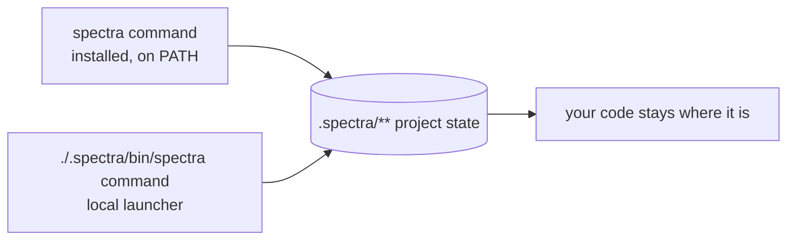
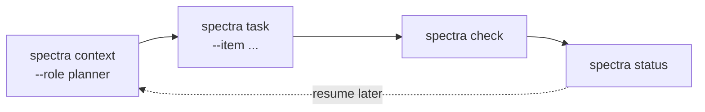

<p align="center">
  
</p>

# Spectra

Spectra gives every AI coding agent — Claude, Cursor, Codex, Copilot, or a human — the same persistent memory of a project: what it does, what's been decided, and what's still open. Instead of re-explaining your architecture and business rules in every chat, agents read it from one place.

The main rule is simple: Spectra owns `.spectra/`. Your product code, company docs, and existing repository layout stay yours.

Under the hood, Spectra follows **SDD (Spec-Driven Development)**: intent, context, and decisions live in structured files Spectra manages, not scattered across chat history.

## Start here

Spectra has one CLI and two profiles:

| Profile | Use it when | What it gives you |
| --- | --- | --- |
| **Lite** (default) | A small personal or project-local memory for one person or agent | context, tasks, status, health checks, and updates |
| **Full** | Team governance, staged approvals, or agent adapters | Lite, plus specs you can approve stage-by-stage, evaluation suites, brownfield-adoption analysis, and generated agent config files |

Most projects should start with Lite. You can select Full during setup:

```bash
spectra init . --profile full
```

## Choose your setup

```text
New project?              spectra init .
Existing project?         spectra adopt .
No Node or npm?           Use the native installation.
Lite → Full?              spectra upgrade --profile full
```

## Five-minute setup

### New project with npm/npx

```bash
mkdir my-product
cd my-product
git init
npx spectra-pack@latest init .
./.spectra/bin/spectra check
./.spectra/bin/spectra status
```

`npx` is only used for the first setup. It does not install a global command; the generated `./.spectra/bin/spectra` launcher is the project-local command.

### Existing project with npm/npx

```bash
cd existing-project
npx spectra-pack@latest adopt .
./.spectra/bin/spectra onboard
./.spectra/bin/spectra check
./.spectra/bin/spectra status
```

### macOS/Linux without Node or npm

```bash
curl -fsSL https://raw.githubusercontent.com/yunusakin/spectra/main/install.sh | sh
export PATH="$HOME/.local/bin:$PATH"
cd existing-project
spectra adopt .
spectra onboard
spectra check
spectra status
```

See [Native Install](docs/native-install.md) for permanent PATH setup and troubleshooting.

After native installation, verify the command:

```bash
spectra version
which spectra
```

## What setup creates

Whichever way you invoke it, Spectra reads and writes the same project state:


```mermaid
flowchart LR
    A["spectra command<br/>installed, on PATH"] --> C
    B["./.spectra/bin/spectra command<br/>local launcher"] --> C
    C[(".spectra/** project state")]
    C --> D["your code stays where it is"]
```

Modern `spectra init` and `spectra adopt` create one Spectra-owned directory in your project:

```text
your-project/
├── your-existing-code/
└── .spectra/
    ├── bin/spectra       # project-local launcher
    ├── cli/              # local Node CLI the launcher falls back to
    ├── config.yaml       # profile, Git mode, and schema
    ├── install.json      # installation and version metadata
    ├── docs/             # Spectra guides
    ├── cache/            # disposable context and repo-index cache (created on first use)
    └── sdd/              # context, business memory, and profile runtime
```

Spectra keeps its own generated project layer under the root `.spectra/` directory. It does not use root `app/`, `docs/`, `spectra/`, `sdd/`, or `.github/` directories as the canonical location for Spectra-owned files.

Full adds these inside the same boundary:

```text
.spectra/sdd/
├── features/             # executable feature specifications
├── governance/           # approval state and decisions
└── adoption/             # existing-project analysis
```

Your application code and company documentation remain in their existing locations.

If you see older instructions that mention copying Spectra files to root-level `docs/`, `sdd/`, `scripts/`, or `.github/`, treat them as legacy implementation details. The supported setup surface is the CLI (`spectra init`, `spectra adopt`, `spectra upgrade`, and `spectra update`) and the canonical generated layout is `.spectra/`.

## Git mode: private or shared

`local` is the default. It writes `/.spectra/` to `.git/info/exclude`, so Spectra stays private while your source code remains visible to Git. It does not modify `.gitignore`.

Use shared mode when the team wants to review and commit Spectra files:

```bash
spectra init . --git-mode shared
spectra adopt . --git-mode shared
```

You cannot change profile or Git mode by repeating `init`. To promote an existing Lite installation to Full, run:

```bash
spectra upgrade --profile full
```

Spectra asks for confirmation, preserves existing memory-bank files, and adds the Full profile files. Add `--agents codex,claude` if you also want agent adapters generated.

`spectra update` updates the CLI and project runtime. `spectra upgrade` changes the installed Lite or Full profile.

## The daily Lite workflow


```mermaid
flowchart LR
    A["spectra context<br/>--role planner"] --> B["spectra task<br/>--item ..."]
    B --> C["spectra check"]
    C --> D["spectra status"]
    D -. "resume later" .-> A
```

Run these commands from the project root:

```bash
# See the project context needed for planning
spectra context --role planner --goal discover

# Record what you intend to implement
spectra task --item TASK-001 --task-type feature --goal "Describe the change"

# Check the Spectra installation and project state
spectra check

# Resume work after a break
spectra status
```

`status` is the resume command. It shows recent project/Spectra changes and the next recommended action. `check` is the health command. Neither command needs a time-window option.

For existing projects, `spectra adopt` writes an initial repo index when possible. Run `spectra onboard` while `projectbrief.md` is still a template, and run `spectra index` again after manifest changes or if adoption reports that indexing failed.

## The Full workflow

Full adds staged governance: each stage below must be explicitly approved before the next one is allowed, so a feature can't skip from "someone had an idea" straight to "released." The usual sequence is:

```bash
spectra context --role planner --goal discover        # load context for planning
spectra check                                          # confirm the project is healthy first
spectra approve --stage product-approved               # gate: the "what" is agreed
spectra approve --stage technical-approved              # gate: the "how" is agreed
spectra approve --stage implementation-approved          # gate: cleared to start coding
spectra task --item FEAT-001 --task-type feature --goal "Implement the product flow"
spectra context --role implementer --goal implement    # load context for coding
spectra eval <feature-id> --suite smoke                 # run the feature's evaluation suite
spectra verify --profile release                        # aggregate checks into a release-confidence score
spectra approve --stage release-approved                # gate: cleared to ship
```

Advanced commands are top-level, for example `spectra approve` and `spectra eval`. `spectra admin <command>` remains a compatibility alias.

## Help and updates

```bash
spectra help
spectra help advanced       # Full commands
spectra update              # check for a newer CLI/runtime
spectra version
```

If Spectra says `Spectra is already up to date.`, no changes are needed. If an update or legacy migration is needed, Spectra asks for confirmation once and preserves user files.

## Common commands

| Command | Purpose |
| --- | --- |
| `spectra init` | Create a new Spectra project |
| `spectra adopt` | Add Spectra to an existing project |
| `spectra index` | Refresh or check the deterministic repo index used by context and verify |
| `spectra onboard` | Draft `projectbrief.md` from user answers and the repo index |
| `spectra context` | Load focused planning or implementation context |
| `spectra task` | Record implementation intent |
| `spectra check` | Validate the installed project layer |
| `spectra doctor --fix` | Repair safe generated Spectra files, then re-run validation |
| `spectra status` | Resume work and see recent updates |
| `spectra update` | Check for updates and migrate old layouts |
| `spectra help` | Learn the everyday command surface |
| `spectra approve`, `eval`, `diff`, `adapters`, `skills`, `quick` | Use Full-profile advanced workflows |

See [CLI Reference](docs/cli-reference.md) for every option and compatibility alias.

## Business context and token efficiency

Spectra keeps durable product knowledge under `.spectra/sdd/memory-bank/business/`. The business index maps each domain to keywords, active rules, unresolved questions, and related technical modules. `spectra context` and `spectra route` use that index to load only the relevant business context for a task instead of dumping every rule into every agent session.

Example domain index:

| Domain | Keywords | Rules | Unresolved | Related Modules |
| --- | --- | --- | --- | --- |
| `customer-policy` | `eligibility`, `limit`, `approval` | `rules.md` | `unresolved.md` | `account-service` |

`spectra route --format json` includes match explanations such as `matchedBy: "keyword"` and `matchedValue: "eligibility"` so routing stays inspectable. New knowledge defaults to unresolved; direct active creation requires explicit verified evidence:

```bash
spectra knowledge add --domain customer-policy --title "Eligibility window" --statement "Requests outside the eligibility window require manual approval." --status active --verified --evidence "Product policy"
```

This keeps the system agent-agnostic: Codex, Claude, Cursor, Copilot, Windsurf, Antigravity, or another tool can read the same canonical Spectra context. Agent-specific files are adapters; the source of truth stays inside `.spectra/`.

## Migrating an older Spectra project

Run the new CLI from the old project root:

```bash
spectra update
```

After confirmation, the legacy 3.0.8 `spectra/` directory, root `sdd/`, and known Spectra-generated docs move under `.spectra/`. Company files are preserved. See [Structure](docs/structure.md) for the resulting layout.

## Documentation

- [Quick Start](docs/quick-start.md) — shortest onboarding path
- [Getting Started](docs/getting-started.md) — detailed Lite and Full workflow
- [CLI Reference](docs/cli-reference.md) — commands and options
- [Structure](docs/structure.md) — what each generated directory means
- [Workflow](docs/workflow.md) — Full governance lifecycle
- [Native Install](docs/native-install.md) — macOS/Linux installation
- [Testing and Verification](docs/testing.md) — quality checks
- [Website](https://yunusakin.github.io/spectra/) — project overview

## Development

```bash
npm install
npm test
npm run validate
npm run verify
```

Repository layout for maintainers:

- `packages/cli/` — npm CLI and repo-local launcher implementation
- `packages/core/assets/runtime/` — runtime scripts copied into installed projects
- `profiles/lite/` and `profiles/full/` — source profile templates
- `packages/templates/` — published profile template package
- `docs/` — contributor/user documentation for this repository
- `scripts/` — repository maintenance scripts, not the supported consumer setup interface

This repository's source is at `3.1.1`. GitHub Releases and npm are published separately; check [Releases](https://github.com/yunusakin/spectra/releases) and [npm](https://www.npmjs.com/package/spectra-pack) for what's installable right now.

## License

MIT. See [LICENSE](LICENSE).
