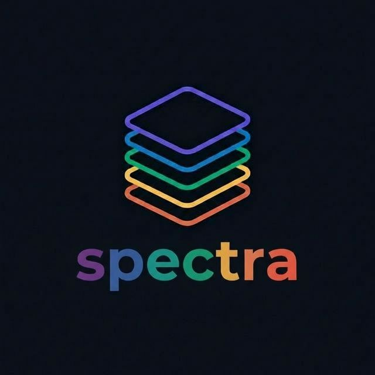

<p align="center">
  
</p>

# Spectra

Spectra is a CLI for spec-driven development. It keeps project context, implementation intent, validation, and—when needed—approval and evaluation state together in a project-local `spectra/` directory.

## Start here

Spectra has one CLI and two profiles:

| Profile | Use it when | What it gives you |
| --- | --- | --- |
| **Lite** (default) | You want a small personal or project-local SDD workflow | context, tasks, status, health checks, and updates |
| **Full** | You need team governance | Lite plus executable feature specs, approvals, evaluations, adoption analysis, and agent adapters |

Most projects should start with Lite. You can select Full during setup:

```bash
spectra init . --profile full
```

## Five-minute setup

### New project with npm/npx

```bash
mkdir my-product
cd my-product
git init
npx spectra-pack@latest init .
./spectra/bin/spectra check
./spectra/bin/spectra status
```

`npx` is only used for the first setup. It does not install a global command; the generated `./spectra/bin/spectra` launcher is the project-local command.

### Existing project with npm/npx

```bash
cd existing-project
npx spectra-pack@latest adopt .
./spectra/bin/spectra status
```

### macOS/Linux without Node or npm

```bash
curl -fsSL https://raw.githubusercontent.com/yunusakin/spectra/main/install.sh | sh
export PATH="$HOME/.local/bin:$PATH"
cd existing-project
spectra adopt .
spectra status
```

See [Native Install](docs/native-install.md) for permanent PATH setup and troubleshooting.

## What setup creates

Spectra owns one directory in your project:

```text
your-project/
├── your-existing-code/
└── spectra/
    ├── bin/spectra       # project-local launcher
    ├── config.yaml       # profile, Git mode, and schema
    ├── install.json      # installation and version metadata
    ├── docs/             # Spectra guides
    └── sdd/              # context and profile runtime
```

Spectra does not create a root `app/`, `docs/`, `sdd/`, `.spectra/`, or `.github/` directory for its own files.

Full adds these inside the same boundary:

```text
spectra/sdd/
├── features/             # executable feature specifications
├── governance/           # approval state and decisions
└── adoption/             # existing-project analysis
```

Your application code and company documentation remain in their existing locations.

## Git mode: private or shared

`local` is the default. It writes `/spectra/` to `.git/info/exclude`, so Spectra stays private while your source code remains visible to Git. It does not modify `.gitignore`.

Use shared mode when the team wants to review and commit Spectra files:

```bash
spectra init . --git-mode shared
spectra adopt . --git-mode shared
```

You cannot change profile or Git mode by repeating `init`. To promote an existing Lite installation to Full, run:

```bash
spectra upgrade --profile full
```

Spectra asks for confirmation, preserves existing memory-bank files, and adds the Full profile files. Add `--agents codex,claude` if you also want agent adapters generated.

## The daily Lite workflow

Run these commands from the project root:

```bash
# See the project context needed for planning
spectra context --role planner --goal discover

# Record what you intend to implement
spectra task --item TASK-001 --task-type feature --goal "Describe the change"

# Check the Spectra installation and project state
spectra check

# Resume work after a break
spectra status
```

`status` is the resume command. It shows recent project/Spectra changes and the next recommended action. `check` is the health command. Neither command needs a time-window option.

## The Full workflow

Full adds staged governance. The usual sequence is:

```bash
spectra context --role planner --goal discover
spectra check
spectra admin approve --stage product-approved
spectra admin approve --stage technical-approved
spectra admin approve --stage implementation-approved
spectra task --item FEAT-001 --task-type feature --goal "Implement the product flow"
spectra context --role implementer --goal implement
spectra admin eval <feature-id> --suite smoke
spectra verify --profile release
spectra admin approve --stage release-approved
```

Advanced commands are grouped under `spectra admin`. Older top-level forms such as `spectra approve` and `spectra eval` remain compatibility aliases.

## Help and updates

```bash
spectra help
spectra help advanced       # Full commands
spectra update              # check for a newer CLI/runtime
spectra version
```

If Spectra says `Spectra is already up to date.`, no changes are needed. If an update or legacy migration is needed, Spectra asks for confirmation once and preserves user files.

## Common commands

| Command | Purpose |
| --- | --- |
| `spectra init` | Create a new Spectra project |
| `spectra adopt` | Add Spectra to an existing project |
| `spectra context` | Load focused planning or implementation context |
| `spectra task` | Record implementation intent |
| `spectra check` | Validate the installed project layer |
| `spectra status` | Resume work and see recent updates |
| `spectra update` | Check for updates and migrate old layouts |
| `spectra help` | Learn the everyday command surface |
| `spectra admin ...` | Use Full-profile advanced workflows |

See [CLI Reference](docs/cli-reference.md) for every option and compatibility alias.

## Migrating an older Spectra project

Run the new CLI from the old project root:

```bash
spectra update
```

After confirmation, legacy `.spectra/`, root `sdd/`, and known Spectra-generated docs move under `spectra/`. Company files are preserved. See [Structure](docs/structure.md) for the resulting layout.

## Documentation

- [Quick Start](docs/quick-start.md) — shortest onboarding path
- [Getting Started](docs/getting-started.md) — detailed Lite and Full workflow
- [CLI Reference](docs/cli-reference.md) — commands and options
- [Structure](docs/structure.md) — what each generated directory means
- [Workflow](docs/workflow.md) — Full governance lifecycle
- [Native Install](docs/native-install.md) — macOS/Linux installation
- [Testing and Verification](docs/testing.md) — quality checks

## Development

```bash
npm install
npm test
npm run validate
npm run verify
```

Current release: `3.0.1`.

## License

MIT. See [LICENSE](LICENSE).
