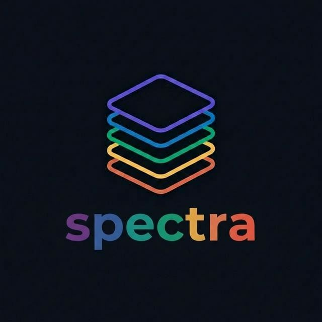

<p align="center">
  
</p>

# Spectra

Persistent, governed project intelligence for interchangeable coding agents.

Coding agents forget between sessions and cannot tell which of your project's rules, requirements and decisions are authoritative. Spectra keeps that knowledge in your repository in a form both people and agents can use: what the project does, which rules and requirements govern it, which tests are supposed to verify them, and what has actually been verified.

**Agents execute. Spectra understands, resolves, governs, traces and verifies project knowledge.** An agent (or you) asks Spectra for the small slice of project knowledge a task needs, still reads and edits the real code, and later asks Spectra whether the evidence supports the change.

Spectra is a local command-line tool. It is not an agent, a hosted service, a code generator or a replacement for your test runner and documentation. It owns `.spectra/`; your application code, company documentation and repository layout remain yours. Every installation includes the same features; there are no Lite/Full profiles to select.

## Get started

Install Spectra once per machine (or just use `npx`), then run `init` or `adopt` once per project.

| Your situation | Command | What it does |
| --- | --- | --- |
| New project | `spectra init .` | Creates the Spectra layer with generic starter files for you to fill in. |
| Existing project | `spectra adopt .` | Installs the same layer and records **repository evidence** (a deterministic index of modules, manifests and tests, plus discovery notes). It never executes your tests or invents business rules: what the code does is evidence, not business truth, until you review and promote it. |

### With Node.js and npm

```bash
cd my-project            # `git init` first for a new project
npx spectra-pack@latest init .      # or: adopt .
```

`npx` bootstraps Spectra without installing a global command. After setup, use the project-local launcher, `./.spectra/bin/spectra`. Check the version with `./.spectra/bin/spectra --version`.

### On macOS or Linux without Node.js

```bash
curl -fsSL https://raw.githubusercontent.com/yunusakin/spectra/main/install.sh | sh
export PATH="$HOME/.local/bin:$PATH"
spectra --version
cd my-project
spectra adopt .          # or: init .
```

See [Native Install](docs/native-install.md) for permanent PATH setup and troubleshooting. The examples below use the project-local launcher; with a native install you can write `spectra` instead.

### Local or shared Git mode

The default **local** mode keeps `.spectra/` private by recording it in `.git/info/exclude`; it does not edit `.gitignore` and nothing Spectra writes reaches your company repository unless you add it. Choose **shared** when your team wants to review and commit Spectra state (derived caches and evidence stay uncommitted):

```bash
npx spectra-pack@latest adopt . --git-mode shared
```

### Agent adapters

Pass the agents you use and Spectra generates small guidance files that point back to `.spectra/`: `codex` (`AGENTS.md`), `claude` (`CLAUDE.md`), `copilot`, `cursor`, `windsurf` and `antigravity`.

```bash
npx spectra-pack@latest init . --agents codex,claude
```

The generated guidance tells an agent to start from `spectra context`, look up the exact subject it is about to change with `spectra inspect`, and check `spectra verify --gate` before handing work off. Agents still inspect and edit the actual code; Spectra supplies bounded, explainable project knowledge, not a substitute for reading it.

## Your first five minutes

```bash
./.spectra/bin/spectra onboard                        # capture project intent (interactive)
./.spectra/bin/spectra check                          # validate the Spectra layer
./.spectra/bin/spectra context --role planner --goal discover
./.spectra/bin/spectra inspect <id>                   # what governs a rule/requirement/module, and why
./.spectra/bin/spectra verify --explain <id>          # why it is verified, failed, stale or unverified
./.spectra/bin/spectra verify --gate review           # does the evidence let review proceed?
./.spectra/bin/spectra status                         # recent changes and the suggested next step
```

`<id>` is a stable ID such as `RULE-ABC-001`, `my-feature#FR-1` or `node:module:packages/api`. For a task, `context --route-task "<task>"` selects only the rules, requirements and modules that task touches. The [CLI reference](docs/cli-reference.md) lists every command and option.

## Core concepts

| Term | Meaning |
| --- | --- |
| Business rule (`RULE-…`) | A durable, evidence-backed statement about the product, stored per domain under `sdd/memory-bank/business/`. Uncertain claims stay in that domain's `unresolved.md`. |
| `FR` / `NFR` / `AC` / `INV` | A feature spec's functional requirements, non-functional requirements, acceptance scenarios and architectural invariants, with stable IDs such as `my-feature#FR-1`. |
| `Governs` | Optional rule metadata linking a rule to the requirement/scenario/invariant IDs it governs. |
| `verifiedBy` | Optional feature-spec metadata naming the test targets that verify a subject. |
| Repo Index | Deterministic, disposable evidence about the repository (modules, manifests, test targets): `cache/index/repo-index.json`. |
| Knowledge Map | Derived lookup of every addressable object; rebuilt automatically from canonical files. |
| Test target | A test command found in the Repo Index; `verify --test-target <id>` runs one and records the result. |
| Verification evidence | The recorded outcome of a test target, kept locally and never committed. |
| `verified` / `failed` / `stale` / `unverified` | A subject's state: its declared scopes all passed, one failed, the evidence is out of date because the code or declarations changed, or no scope has a result. |
| Review / release gate | `verify --gate review\|release`: blocks only when a declared scope failed, is stale or has no result. Evidence is scoped: a passing test target supports the subjects that declare it, it does not prove a requirement true everywhere. |
| Project Intelligence | The combined capability: resolve, trace and verify project knowledge on demand through `context`, `inspect` and `verify`. |

Canonical knowledge (rules, feature specs, approvals) lives under `.spectra/sdd/`. Caches, the Repo Index, the Knowledge Map and verification evidence under `.spectra/cache/` are derived and can always be rebuilt.

## What Spectra adds to a project

Spectra keeps its runtime, project context, feature specifications and approvals under `.spectra/`. It does not use root-level `app/`, `docs/`, `sdd/`, `spectra/` or `.github/` as its data directories. If you request agent adapters, the small adapter files are written to the paths each tool requires.

```text
acme/
├── .spectra/
│   ├── bin/spectra                    # project-local command
│   ├── cli/                           # Node fallback, when applicable
│   ├── sdd/                           # memory, specs, governance and runtime
│   ├── docs/spectra/                  # shipped Spectra usage guides
│   ├── docs/acme/                     # compatible plugin/skill artifacts
│   ├── cache/                         # derived: repo index, knowledge map, evidence
│   └── install.json                   # versions, names and ownership
├── CLAUDE.md                          # optional tool-required projection
└── .git/info/exclude                  # local mode adds /.spectra/
```

## A typical work session

```bash
# Load relevant context for the task
./.spectra/bin/spectra context --role implementer --goal implement --route-task "Describe the change"

# Record the work before implementation
./.spectra/bin/spectra task --item TASK-001 --task-type feature --goal "Describe the change"

# After the change: run the declared tests and see what they support
./.spectra/bin/spectra verify --test-target <test-target-id>
./.spectra/bin/spectra verify --gate review --changed
./.spectra/bin/spectra check
```

`spectra verify` without flags aggregates release-readiness signals and does not run your application's own test command; `verify --test-target` is the explicit way to run one. The staged approval and release process is described in the [Workflow guide](docs/workflow.md).

## Updating, migrating and uninstalling

These are three separate lifecycles:

- **`spectra update`** updates the *application* on a machine (a verified native install). It never inspects or changes a project. Global npm users update with `npm install -g spectra-pack@latest`; npx users run `npx spectra-pack@latest` for a newer CLI.
- **`spectra migrate`** advances one *project's* layout/schema, only when you ask. Nothing migrates silently. `migrate --check` reports the required steps without writing; `migrate --yes` applies them.
- **`spectra uninstall`** removes the verified native application files and leaves every project unchanged.

Derived caches (such as the Knowledge Map) rebuild on their own after an update and never require `migrate`. See [Getting Started](docs/getting-started.md) for both update paths.

## Common commands

| Command | Purpose | Project effect |
| --- | --- | --- |
| [`spectra init`](docs/cli-reference.md#init) | Set up a new project | Creates the Spectra layer; local mode updates Git info/exclude; optional adapters use tool-required paths. |
| [`spectra adopt`](docs/cli-reference.md#adopt) | Add Spectra to an existing project | Installs the layer and writes repository index/discovery evidence. |
| [`spectra onboard`](docs/cli-reference.md#onboard) | Capture project intent | Interactive runs write projectbrief.md; non-interactive runs only report context. |
| [`spectra index`](docs/cli-reference.md#index) | Refresh repository evidence | Replaces cache/index/repo-index.json; --check does not write project files. |
| [`spectra context`](docs/cli-reference.md#context) | Load focused context | Reads canonical memory and refreshes derived cache/context summaries. |
| [`spectra route`](docs/cli-reference.md#route) | Select relevant modules/domains | Reads knowledge indexes; does not write project files. |
| [`spectra inspect`](docs/cli-reference.md#inspect) | Explain one subject or the impact of changed files | Read-only; never runs tests or touches approvals. |
| [`spectra task`](docs/cli-reference.md#task) | Record implementation intent | Replaces memory-bank/core/implementation-brief.md. |
| [`spectra check`](docs/cli-reference.md#check) | Validate the Spectra layer | Reports structure/policy/contract errors; no persistent project writes. |
| [`spectra eval`](docs/cli-reference.md#eval) / [`verify`](docs/cli-reference.md#verify) | Evaluate contracts / assess readiness and evidence | Writes eval reports; `verify` also refreshes approval validity; `--test-target` records local evidence; `--explain` and `--gate` are read-only. Configured command-mode evals can execute application commands. |
| [`spectra status`](docs/cli-reference.md#status) | Resume work | Recomputes approval validity and syncs approval status into project memory. |
| [`spectra doctor`](docs/cli-reference.md#doctor) | Inspect or repair health | Read-only by default; --fix refreshes safe generated files and preserves user-owned documents/adapters. |
| [`spectra update`](docs/cli-reference.md#update) | Update application software | Updates a verified native machine installation; it does not inspect or migrate projects. |
| [`spectra migrate`](docs/cli-reference.md#migrate) | Migrate one project | `--check` is read-only; `--yes` explicitly applies supported layout/schema steps to that project. |
| [`spectra uninstall`](docs/cli-reference.md#uninstall) | Remove the native application | Removes verified machine-owned native files and leaves every project unchanged. |
| [`spectra help`](docs/cli-reference.md#help) | Browse commands/options | Prints help; does not write project files. |

Paths in this table are beneath `.spectra/` unless a Git or adapter path is stated. Advanced commands (`approve`, `eval`, `diff`, `quick`, `skills`, `adapters`) appear under `spectra help advanced`. See the [complete command effects reference](docs/cli-reference.md#command-effects-at-a-glance) for all **24 public commands**, prerequisites, options, before/after file trees and workflow diagrams.

## Documentation

- [Overview](docs/overview.md) — the product in more depth
- [Quick Start](docs/quick-start.md) — bootstrap and first workflow
- [Getting Started](docs/getting-started.md) — setup choices and generated state
- [CLI Reference](docs/cli-reference.md) — every command and option
- [Workflow](docs/workflow.md) — approvals, evaluations, and release readiness
- [Testing and Verification](docs/testing.md) — what `check`, `eval`, and `verify` cover
- [Structure](docs/structure.md) — Spectra-owned files and directories
- [Native Install](docs/native-install.md) — macOS/Linux installation and troubleshooting
- [Business Context](docs/business-context.md) — durable business rules and context routing
- [Agent JSON contract](docs/agent-json-contract.md) — stable machine-readable output for agents
- [Website](https://yunusakin.github.io/spectra/) — project overview

## Contributing

```bash
npm ci
npm test
npm run check
```

Spectra's source is organized into `packages/cli/`, `packages/core/`, and `packages/templates/`. The `sdd/` directory in this repository is Spectra's own project knowledge (it describes Spectra itself); the starter files other projects receive come from `profiles/full/` and `packages/core/assets/runtime/`.

## Releases and license

- [GitHub Releases](https://github.com/yunusakin/spectra/releases) — native macOS/Linux downloads
- [spectra-pack on npm](https://www.npmjs.com/package/spectra-pack) — Node.js CLI
- MIT license — see [LICENSE](LICENSE)
