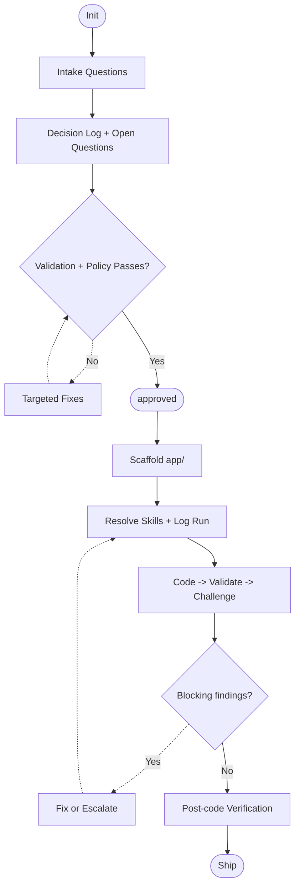

<p align="center">
  
</p>


Spectra is a spec-driven development backbone for AI-assisted software projects.
It keeps requirements, decisions, and execution context in structured files so agents can build reliably across sessions.

## Quick Install

```bash
# From within the Spectra repo — install into your project:
./scripts/init.sh /path/to/your-project

# Or from any directory (downloads automatically):
bash <(curl -sL https://raw.githubusercontent.com/yunusakin/spectra/main/scripts/init.sh)
```

The script copies all Spectra files and optionally walks you through 3 quick questions to pre-fill your project brief.

## What Spectra Is

- A workflow: intake -> specs -> validation -> `approved` -> scaffold -> sprint loop -> verification.
- A structure: rules in `sdd/.agent/`, specs in `sdd/memory-bank/`, code in `app/`.
- A guardrail system: explicit approval gate, validation checks, policy checks, and traceability.

## Golden Path

1. Start intake with `init`.
2. Answer phased questions (Core -> Type-specific -> Advanced optional).
3. Confirm technical decisions and record them in intake state.
4. Resolve open technical questions.
5. Run validation and policy checks.
6. Reply `approved`.
7. Agent scaffolds under `app/`.
8. Agent runs sprint loop: plan -> resolve skills -> log skill run -> code -> validate -> challenge -> fix/escalate -> verify.

## Intake Decision Loop

For technical choices, Spectra enforces:
- stable `question_id`
- options + recommendation
- explicit user confirmation
- final value in specs

If unresolved, the question is tracked as `open` in `sdd/memory-bank/core/intake-state.md` and blocks approval.

## Skill Graph Contract

For post-approval implementation work, skill ordering is enforced.

Canonical artifacts:
- Visual graph: `sdd/.agent/skills/dependency-graph.md`
- Machine-readable map: `sdd/.agent/skills/dependency-map.tsv`
- Run log: `sdd/memory-bank/core/skill-runs.md`

Before coding an item:

```bash
bash scripts/resolve-skills.sh --task-type <task_type>
```

If explicit skill order is provided:

```bash
bash scripts/resolve-skills.sh --task-type <task_type> --skills <csv>
```

If resolver fails, coding is blocked.

## Quality Gate Loop

Every implementation item follows:
1. Coding pass
2. Validation pass
3. Challenge pass

A module cannot be considered stable with unresolved `critical` or `warning` findings.
Findings are tracked in `sdd/memory-bank/core/review-gate.md`.

## Escalation Rules

- Max correction iterations per blocked item: `3`.
- If still blocked, escalate to human decision and log the blocker in:
  - `sdd/memory-bank/core/activeContext.md`
  - `sdd/memory-bank/core/review-gate.md`
  - `sdd/memory-bank/core/progress.md`

## Open Question Lifecycle

1. Create/track unresolved technical questions in `intake-state.md`.
2. Attach an issue reference for each `open` row.
3. Resolve question and update status to `resolved`.
4. Re-run checks, then proceed to approval.

## First 10 Minutes

From repo root:

```bash
# 1) Start intake in your AI agent
init

# 2) Validate repository/rules integrity
bash scripts/validate-repo.sh --strict

# 3) Run policy checks
bash scripts/check-policy.sh

# 4) After validation passes and specs look good
# reply in the agent chat:
approved

# 5) Quick health snapshot
bash scripts/health-check.sh
```

## High-Level Flow



## Repository Layout

```text
sdd/
├── .agent/                # Rules, skills, scaffolds, prompts
└── memory-bank/           # Specs, context, progress, traceability
app/                       # Application code (after approval only)
docs/                      # Guides and examples
scripts/                   # Validation, policy, health, spec diff helpers
```

## Core Commands

| Command | Purpose |
|---|---|
| `bash scripts/validate-repo.sh --strict` | Validate indexes, links, adapter consistency, templates |
| `bash scripts/check-policy.sh` | Enforce approval/open-question/review-gate/progress/skill-graph policies |
| `bash scripts/check-policy.sh --base <sha> --head <sha>` | Range-aware policy check for CI/PR validation |
| `bash scripts/resolve-skills.sh --task-type <type>` | Resolve graph-compliant skill order for implementation work |
| `bash scripts/health-check.sh` | Quick project health snapshot |
| `bash scripts/spec-diff.sh --update` | Append spec diff report entry |

## Documentation Map

- `docs/quick-start.md` - shortest happy path.
- `docs/overview.md` - principles and lifecycle.
- `docs/getting-started.md` - detailed walkthrough.
- `docs/workflow.md` - resume, sprint loop, role gates, re-approval, rollback.
- `docs/testing.md` - validation and policy test scenarios.
- `docs/spec-merge.md` - safe spec merge patterns.
- `docs/examples/` - intake answer examples by app type.

## Release History

| Version | Date | Highlights | Notes |
|---|---|---|---|
| `v1.0.2` | 2026-02-22 | Token-efficient intake question packs + runtime minimal context; Skill Graph enforcement and hard-fail gates | See [CHANGELOG.md](CHANGELOG.md) |
| `v1.0.1` | 2026-02-18 | Intake decision governance, open-question blockers, role-based quality gate, escalation policy, policy hardening | See [CHANGELOG.md](CHANGELOG.md) |
| `v1.0.0` | 2026-02-17 | First stable Spectra release | [GitHub Release](https://github.com/yunusakin/spectra/releases/tag/v1.0.0) |

## What's New in v1.0.2

### Feature: Token-Efficient Intake Context
- Split large intake question corpus into phase/app-type packs under `sdd/.agent/rules/intake/questions/`.
- Converted `sdd/.agent/rules/intake/01-questions.md` into a lightweight router.
- Added `sdd/.agent/runtime/minimal.md` to enforce minimal context loading by mode and phase.
- Updated intake flow and adapters to avoid preloading unrelated packs.

### Feature: Skill Graph Enforcement
- Added canonical skill dependency map `sdd/.agent/skills/dependency-map.tsv`.
- Added `scripts/resolve-skills.sh` for graph-compliant skill ordering per task type.
- Enforced hard-fail policy checks for skill runs on `app/*` changes.
- Added `sdd/memory-bank/core/skill-runs.md` for auditable skill execution order tracking.

## What's New in v1.0.1
- Added intake decision governance with explicit confirmation and decision logging.
- Added open technical question lifecycle with blocking policy enforcement.
- Added role-based quality gate loop (`code -> validate -> challenge`) with escalation rules.
- Hardened CI/policy checks for approval state, unresolved findings, and traceability trails.

## License

MIT — see [`LICENSE`](LICENSE).
