# Spectra

A spec-driven development backbone for working with AI coding agents. It keeps your project specs, decisions, and context in structured files so agents don't lose track of what they're building between sessions.

Specs live in `sdd/memory-bank/`, agent rules in `sdd/.agent/`, application code in `app/`.

---

## How It Works

```mermaid
flowchart TD
    Init(["🧩 Init"]) --> Intake["📝 Intake"]

    subgraph spec [" "]
        direction TB
        Intake --> Specs["📄 Specs"]
        Specs --> Validate{"Validate"}
        Validate -.->|Fail| Fix["🔧 Fix"]
        Fix -.-> Validate
    end

    Validate ==>|Pass| Approve{{"🔒 Approved"}}

    subgraph dev [" "]
        direction TB
        Approve ==> Scaffold["🏗️ Scaffold"]
        Scaffold ==> Sprint["🔄 Sprint Loop"]
        Sprint ==> Verify["✅ Verify"]
        Verify -->|Next item| Sprint
    end

    Verify ==>|Sprint done| Ship(["🚀 Ship"])

    classDef start fill:#6C5CE7,stroke:#6C5CE7,color:#fff,font-weight:bold
    classDef phase fill:#0984E3,stroke:#0984E3,color:#fff
    classDef gate fill:#00B894,stroke:#00B894,color:#fff,font-weight:bold
    classDef action fill:#FDCB6E,stroke:#F39C12,color:#2D3436
    classDef finish fill:#E17055,stroke:#E17055,color:#fff,font-weight:bold
    classDef fix fill:#D63031,stroke:#D63031,color:#fff

    class Init start
    class Intake,Specs,Scaffold,Sprint,Verify phase
    class Approve gate
    class Fix fix
    class Ship finish

    style spec fill:none,stroke:#0984E3,stroke-width:2px,stroke-dasharray:5 5,color:#0984E3
    style dev fill:none,stroke:#00B894,stroke-width:2px,stroke-dasharray:5 5,color:#00B894
```



| Phase | What Happens |
|-------|-------------|
| **Init** | Agent reads the rules, starts intake |
| **Intake** | Asks project questions in phases (core, type-specific, advanced) |
| **Specs** | Fills in spec files under `sdd/memory-bank/` |
| **Validation** | Checks for missing or incomplete specs — loops until clean |
| **Approval** | You review the specs and reply `approved` — nothing gets built before this |
| **Scaffold** | Sets up the project skeleton under `app/` |
| **Sprint Loop** | Picks sprint items, codes, tests, tracks progress |
| **Verify** | Checks build, tests, spec alignment before marking done |
| **Ship** | Changelog, migration checks, rollback plan |

## Quick Start

1. Pick an adapter for your agent:

   | Agent | File |
   |-------|------|
   | Codex | [`AGENTS.md`](AGENTS.md) |
   | Claude | [`CLAUDE.md`](CLAUDE.md) |
   | Cursor | [`.cursorrules`](.cursorrules) |
   | Other | [`AGENT.md`](AGENT.md) |

2. Run `init` in your agent prompt.
3. Answer the intake questions. Bullets in one message is fine.
4. Reply `approved` when validation passes.
5. The agent scaffolds the project and starts working through the sprint.

> If interrupted mid-intake, just run `init` again. State is saved in [`intake-state.md`](sdd/memory-bank/core/intake-state.md).

## Repo Layout

```text
sdd/
├── memory-bank/           # Project specs — the persistent "memory"
│   ├── core/              # Brief, progress, traceability, sprints
│   ├── tech/              # Stack, environments, integrations
│   └── arch/              # Patterns, decisions
├── .agent/
│   ├── rules/             # Intake, workflow, approval, domain standards
│   ├── skills/            # API, DB, security, testing, ops checklists
│   ├── scaffolds/         # Project skeleton templates per app type
│   ├── plans/             # Feature, integration, migration, release, UI plans
│   └── prompts/           # Reusable prompts
app/                       # Application code (after approval only)
scripts/                   # Validation, policy checks, health dashboard
docs/                      # Docs and examples
```

## What You Get

**Memory Bank** — Structured spec files that carry over between sessions. Agents read `activeContext.md` on startup and write to `progress.md` after each task.

**Scaffolding** — After approval, the agent picks a scaffold template (backend API, frontend, full-stack, CLI, or worker) and sets up the project under `app/`.

**Sprint loop** — The agent works through sprint items one at a time: pick, plan, apply relevant skill checklists, code, test, verify, update progress, repeat.

**Traceability** — A map linking each requirement to its code and test locations. Makes spec drift visible.

**Post-code checks** — Build passes, tests pass, code matches specs, traceability updated — all verified before a task is marked done.

**Skill auto-selection** — The agent picks the right checklists (API design, DB migration, security, testing) based on what the task touches.

**Health dashboard** — `bash scripts/health-check.sh` prints a quick status of intake, approval, sprint progress, test coverage, and spec freshness.

**CI enforcement** — `validate-repo.sh` (strict mode) + `check-policy.sh` run on every push.

## Rules

1. No code before `approved`.
2. All code goes under `app/`. Specs stay in `sdd/`.
3. Specs get updated before code, not after.
4. `progress.md` and `activeContext.md` stay current after every task.
5. Build, test, and trace before calling anything done.

## Workflow Scenarios

### Sprint Execution

How the agent works through backlog items after approval.

```mermaid
flowchart TD
  Pick(["📋 Pick"]) ==> Plan["📐 Plan"]
  Plan ==> Skill{{"🧩 Skill Check"}}
  Skill ==> Code["💻 Code"]
  Code ==> Test{"🧪 Test"}
  Test -.->|Fail| Code
  Test ==>|Pass| Verify["✅ Verify"]
  Verify ==> Update["📊 Update"]
  Update -->|More items| Pick
  Update ==>|Sprint done| Done(["🚀 Done"])

  Code -.->|Spec gap| Discovery["🔍 Discovery"]
  Discovery -.->|Approved| Plan

  classDef start fill:#6C5CE7,stroke:#6C5CE7,color:#fff,font-weight:bold
  classDef work fill:#0984E3,stroke:#0984E3,color:#fff
  classDef check fill:#00B894,stroke:#00B894,color:#fff,font-weight:bold
  classDef warn fill:#FDCB6E,stroke:#F39C12,color:#2D3436
  classDef finish fill:#E17055,stroke:#E17055,color:#fff,font-weight:bold

  class Pick start
  class Plan,Code,Update work
  class Skill,Test,Verify check
  class Discovery warn
  class Done finish
```



### Validation Failures

Agent asks targeted follow-ups until validation passes.

```mermaid
flowchart LR
  Intake(["📝 Answers"]) ==> Check{"Validate"}
  Check -.->|Fail| Report["⚠️ Errors"]
  Report -.-> Fix["🔧 Fix"]
  Fix -.-> Update["📄 Update"]
  Update -.-> Check
  Check ==>|Pass| Next(["✅ Next"])

  classDef start fill:#0984E3,stroke:#0984E3,color:#fff
  classDef ok fill:#00B894,stroke:#00B894,color:#fff,font-weight:bold
  classDef err fill:#D63031,stroke:#D63031,color:#fff
  classDef fix fill:#FDCB6E,stroke:#F39C12,color:#2D3436

  class Intake start
  class Check,Update start
  class Report err
  class Fix fix
  class Next ok
```



### Spec Changes After Approval

Requirements change — update specs first, then code.

```mermaid
flowchart TD
  Change(["💡 Change needed"]) ==> Type{"Type?"}

  Type -->|Clarification| Update["📝 Update specs"]
  Type ==>|Behavioral| Specs["📝 Update specs"]

  Specs ==> History["📚 Spec history"]
  History ==> Reapprove{{"🔒 Re-approve"}}
  Reapprove ==>|Approved| Code["💻 Update code"]
  Reapprove -.->|Rejected| Specs

  Update ==> Code
  Code ==> Verify["✅ Verify"]
  Verify ==> Done(["Continue"])

  classDef start fill:#6C5CE7,stroke:#6C5CE7,color:#fff
  classDef work fill:#0984E3,stroke:#0984E3,color:#fff
  classDef gate fill:#00B894,stroke:#00B894,color:#fff,font-weight:bold
  classDef finish fill:#00B894,stroke:#00B894,color:#fff

  class Change start
  class Update,Specs,History,Code work
  class Type,Reapprove gate
  class Verify,Done finish
```



See [`docs/getting-started.md`](docs/getting-started.md) and [`docs/workflow.md`](docs/workflow.md) for more detail.

## Example Intake

```
Project name:       Customer Orders Service
Purpose:            Manage customer orders, payments, and shipment status
App type:           Backend API
Language + version: Java 21
Framework:          Spring Boot 3.2
Architecture:       Hexagonal
Data store:         PostgreSQL 16
Deployment:         Kubernetes
API style:          REST
```

## Docs

| Doc | What it covers |
|-----|---------------|
| [`overview.md`](docs/overview.md) | Principles and design philosophy |
| [`quick-start.md`](docs/quick-start.md) | Shortest path: init → validate → approved |
| [`getting-started.md`](docs/getting-started.md) | Full walkthrough |
| [`workflow.md`](docs/workflow.md) | Resume, spec changes, rollback |
| [`testing.md`](docs/testing.md) | Validation and regression |
| [`spec-merge.md`](docs/spec-merge.md) | Merging specs safely |
| [`multi-project.md`](docs/multi-project.md) | Monorepo patterns |
| [`examples/`](docs/examples/) | Common app type scenarios |

## License

See [`LICENSE`](LICENSE).
