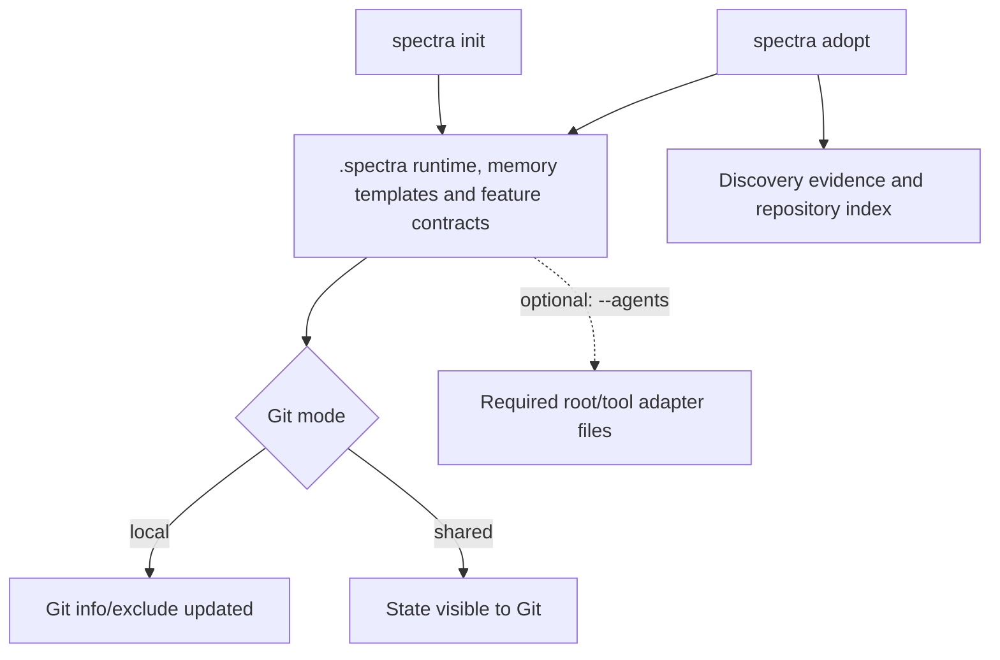
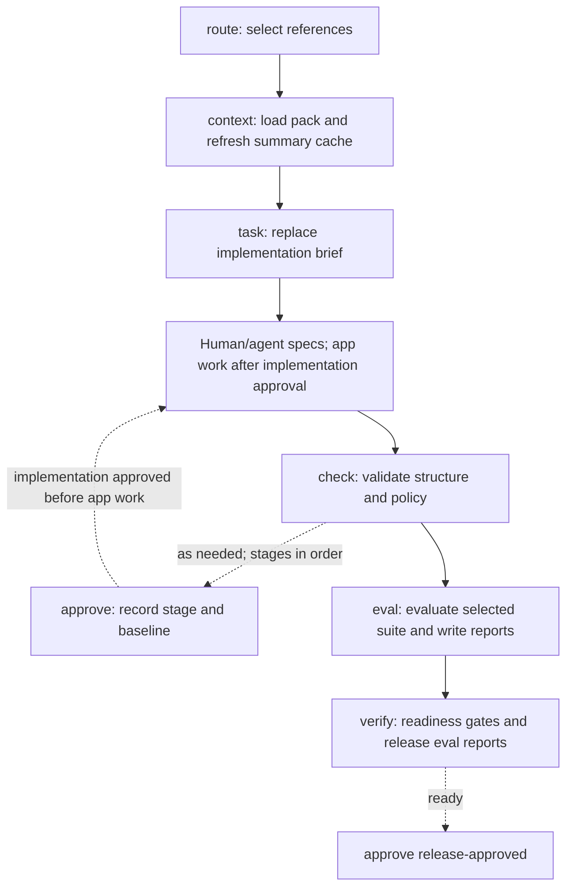
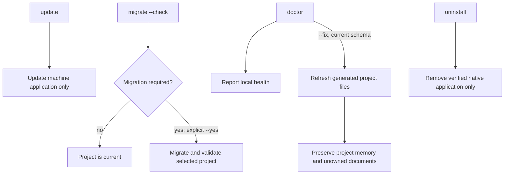

# CLI Reference

This reference describes the commands implemented by the current Spectra runtime. Paths below are relative to the **consumer project root**, not the Spectra source repository. `<feature>` and `<project-name>` are placeholders, not literal directory names.

## Run Spectra

For an existing Git repository:

```bash
npx spectra-pack@latest adopt .
./.spectra/bin/spectra onboard
./.spectra/bin/spectra check
./.spectra/bin/spectra status
```

For a new project, create a directory and run `git init` before `npx spectra-pack@latest init .` in default local mode. Native users can run `spectra` directly; npm/npx users substitute `./.spectra/bin/spectra` (Windows: `.spectra\bin\spectra.cmd`) in the examples below. See [Native Install](native-install.md).

Local and installed invocations operate on the same project state. Most project commands accept `--cwd <path>`; `init`/`adopt` take a positional target path. Runtime shell scripts are implementation details, not an additional user-facing command surface.

## Command effects at a glance

“Writes” includes disposable caches and governance/report updates. A failed command can still write intermediate state. Commands that invoke configured application shell commands have effects beyond Spectra’s own files.

| Command | Use when | Project effect |
| --- | --- | --- |
| [`init`](#init) | Bootstrap a new project | Creates `.spectra/bin/`, `.spectra/cli/` for the Node fallback, `.spectra/sdd/`, `.spectra/docs/spectra/`, `.spectra/docs/<project-name>/`, `.spectra/config.yaml` and `.spectra/install.json`; local mode updates Git’s shared `info/exclude` file |
| [`adopt`](#adopt) | Add Spectra to an existing codebase | Installs the same layer as init; additionally writes `.spectra/cache/index/repo-index.json`, `.spectra/sdd/memory-bank/discovery/*.md`, the technical module map and `.spectra/sdd/adoption/{current-state.summary,gap-analysis,review-queue}.yaml` |
| [`onboard`](#onboard) | Capture project intent from your answers | Interactive runs write `.spectra/sdd/memory-bank/core/projectbrief.md` |
| [`context`](#context) | Load focused context before planning, implementation or review | Creates or refreshes `.spectra/cache/context/*.summary.json`; canonical source documents are not edited |
| [`task`](#task) | Record intent before implementation | Overwrites `.spectra/sdd/memory-bank/core/implementation-brief.md` with the supplied item, goal and template sections |
| [`route`](#route) | Select relevant technical modules and business domains | Does not write project files |
| [`knowledge`](#knowledge) | Record durable business rules and manage their lifecycle | Updates `.spectra/sdd/memory-bank/business/INDEX.md` and domain `rules.md` / `unresolved.md` |
| [`index`](#index) | Refresh evidence after bootstrap or manifest changes | Default mode writes `.spectra/cache/index/repo-index.json` |
| [`check`](#check) | Validate the Spectra layer after changes | Does not write persistent project files; validation smoke checks use temporary directories |
| [`verify`](#verify) | Assess release readiness before handoff | Refreshes `.spectra/sdd/governance/approval-state.yaml` and intake approval status; runs release evals and overwrites each selected feature’s `evals/reports/latest.json` and `latest.md` |
| [`status`](#status) | Resume work and see recent changes | Recomputes `.spectra/sdd/governance/approval-state.yaml` and syncs approval status in `.spectra/sdd/memory-bank/core/intake-state.md` |
| [`update`](#update) | Update application software | Updates a verified managed native installation; other provenances receive package-manager or installation guidance. Project files are not read or written |
| [`migrate`](#migrate) | Migrate one project's layout or schema | `--check` is read-only; an explicit migration changes only the selected project and validates it |
| [`uninstall`](#uninstall) | Remove the managed native application | Removes verified machine-owned versions and command; never accesses project files |
| [`doctor`](#doctor) | Inspect local tools, runtime and adapter health | Without --fix: does not write project files |
| [`approve`](#approve) | Advance the staged approval lifecycle | Updates `.spectra/sdd/governance/approval-state.yaml` with stage/baseline/timestamp and syncs `.spectra/sdd/memory-bank/core/intake-state.md`; release approval also writes eval reports |
| [`eval`](#eval) | Evaluate feature contracts or configured application behavior | Overwrites `.spectra/sdd/features/<feature>/evals/reports/latest.json` and `latest.md` |
| [`diff`](#diff) | Understand specification changes and approval impact | `init` and `update` initialize/append `.spectra/sdd/memory-bank/core/spec-diff.md` by default |
| [`quick`](#quick) | Run a focused docs/rules/spec/ops validation lane | Does not write persistent project files; validation uses temporary smoke projects |
| [`skills`](#skills) | Resolve skill execution order for a task | Does not write project files |
| [`adapters`](#adapters) | Generate instructions for the AI tools you use | Writes required root/tool files in the target: AGENTS.md, CLAUDE.md, .github/copilot-instructions.md, .cursor/rules/, .windsurf/rules/ or .agent/rules/ |
| [`version`](#version) | Confirm the installed executable version | Does not write project files |
| [`help`](#help) | Discover commands and their options | Does not write project files |

## Visual guide

These diagrams show a recommended workflow, not a requirement to run every command. Dashed arrows indicate optional or conditional steps. Application work is performed by your tools; Spectra commands do not implement your feature.

### Setup and generated state



### Daily work and release readiness



### Maintenance and preservation



## init

**When to use:** Bootstrap a new project.

**Prerequisites:** Git worktree for default local mode; bash and installed Spectra.

**Reads:** Packaged runtime/templates; existing install metadata and Git policy.

**Writes/changes:** Creates `.spectra/bin/`, `.spectra/cli/` for the Node fallback, `.spectra/sdd/`, `.spectra/docs/spectra/`, `.spectra/docs/<project-name>/`, `.spectra/config.yaml` and `.spectra/install.json`; local mode updates Git’s shared `info/exclude` file.

**Result:** Installation summary; adapter health when requested.

**Modes and repeat runs:** `[path]`, `--git-mode local|shared`, `--agents <csv>`. Local mode leaves `.gitignore` unchanged; shared mode leaves generated state visible to Git. Existing user memory is copied only when missing. Existing foreign adapters cause refusal before install; regenerate deliberately through adapters if needed.

**Example:**

```bash
spectra init . --agents claude
```

**Before → after (affected paths only):**

```text
.spectra/ absent → bin/, cli/ (Node fallback), sdd/, docs/spectra/, docs/<project-name>/, config.yaml, install.json
CLAUDE.md absent → generated when --agents claude is requested
.git/info/exclude → /.spectra/ added in local mode
```
## adopt

**When to use:** Add Spectra to an existing codebase.

**Prerequisites:** Same installation prerequisites as init.

**Reads:** Application manifests/source layout; packaged runtime/templates; existing Spectra memory.

**Writes/changes:** Installs the same layer as init; additionally writes `.spectra/cache/index/repo-index.json`, `.spectra/sdd/memory-bank/discovery/*.md`, the technical module map and `.spectra/sdd/adoption/{current-state.summary,gap-analysis,review-queue}.yaml`.

**Result:** Discovery evidence, unconfirmed findings and onboarding next step.

**Modes and repeat runs:** `[path]`, `--git-mode local|shared`, `--agents <csv>`. Does not execute manifest test commands or infer business responsibilities. Re-adoption regenerates discovery evidence; an indexing failure is reported and shell discovery remains available.

**Example:**

```bash
spectra adopt .
```

**Before → after (affected paths only):**

```text
.spectra/ absent → installed Spectra layer
.spectra/cache/index/repo-index.json absent → evidence index
.spectra/sdd/memory-bank/discovery/*.md → repository observations
.spectra/sdd/memory-bank/tech/modules.md → unconfirmed manifest module map
```
## onboard

**When to use:** Capture project intent from your answers.

**Prerequisites:** Installed project; interactive terminal to write a brief.

**Reads:** Existing project brief; optional cached repository index; interactive answers.

**Writes/changes:** Interactive runs write `.spectra/sdd/memory-bank/core/projectbrief.md`. Non-interactive runs do not write project files.

**Result:** Index summary or confirmation that the brief was written/skipped.

**Modes and repeat runs:** `--force` permits replacing a brief that already has meaningful content, but still requires an interactive terminal. Missing index does not prevent interactive onboarding. Renaming the brief does not change persisted docsProjectName.

**Example:**

```bash
spectra onboard
```

**Before → after (affected paths only):**

```text
.spectra/sdd/memory-bank/core/projectbrief.md
  template → answers and evidence-labeled technical context (interactive only)
```
## context

**When to use:** Load focused context before planning, implementation or review.

**Prerequisites:** Installed project.

**Reads:** Role/goal policies; memory, governance and feature contracts; optional repo index, routing and Git changes.

**Writes/changes:** Creates or refreshes `.spectra/cache/context/*.summary.json`; canonical source documents are not edited.

**Result:** Selected references, inline content or JSON; budget warnings and next action.

**Modes and repeat runs:** `--role`, `--goal`, `--task <legacy_pack>` (see compatibility aliases), `--format refs|inline|json`, `--route-task`, `--domain`, `--module`, `--changed`, `--base` and `--head`. Every output format may refresh summaries; repeat runs reuse summaries when sources are unchanged.

**Example:**

```bash
spectra context --role planner --goal discover
```

**Before → after (affected paths only):**

```text
.spectra/cache/context/ absent or stale
  → project.summary.json, review.summary.json and other derived summaries
```
## task

**When to use:** Record intent before implementation.

**Prerequisites:** Installed project; item ID, work type and goal.

**Reads:** Command arguments and existing runtime location.

**Writes/changes:** Overwrites `.spectra/sdd/memory-bank/core/implementation-brief.md` with the supplied item, goal and template sections.

**Result:** Implementation brief confirmation.

**Modes and repeat runs:** `--item`, `--task-type`, `--goal`. Repeated runs replace the previous brief; they do not implement the task or advance approvals.

**Example:**

```bash
spectra task --item TASK-001 --task-type feature --goal "Document command effects"
```

**Before → after (affected paths only):**

```text
.spectra/sdd/memory-bank/core/implementation-brief.md
  previous task → current item, work type, goal and planning sections
```
## route

**When to use:** Select relevant technical modules and business domains.

**Prerequisites:** Installed project with valid technical/business indexes.

**Reads:** `.spectra/sdd/memory-bank/tech/modules.md`, business index, domain rules and routing keywords.

**Writes/changes:** Does not write project files.

**Result:** References or JSON with deterministic matching explanations.

**Modes and repeat runs:** `--task`, `--domain <csv>`, `--module <csv>`, `--format refs|json`. Unknown explicit domains/modules fail; repeated runs only read current knowledge.

**Example:**

```bash
spectra route --task "Review billing rules"
```
## knowledge

**When to use:** Record durable business rules and manage their lifecycle.

**Prerequisites:** Installed project; domain/title/statement for add or rule ID for transitions.

**Reads:** Business domain index; existing domain rules and unresolved entries.

**Writes/changes:** Updates `.spectra/sdd/memory-bank/business/INDEX.md` and domain `rules.md` / `unresolved.md`.

**Result:** Stable rule ID, status and domain.

**Modes and repeat runs:** `add` defaults to unresolved; direct `--status active` requires `--verified`. `promote` and `resolve` move an unresolved rule to rules.md. `supersede` and `deprecate` change an active-file rule’s status without moving it to a new file; unresolved rules must first be promoted. Repeated add refuses duplicate statements; repeat promotion of an already promoted ID fails.

**Example:**

```bash
spectra knowledge add --domain billing --title "Invoice review" --statement "Draft invoices require review."
```

**Before → after (affected paths only):**

```text
.spectra/sdd/memory-bank/business/
  INDEX.md → domain routing row added when missing
  billing/unresolved.md absent → BR rule with unresolved status
  billing/rules.md → receives that same ID after promote/resolve
```

### Knowledge lifecycle modes

| Mode | Effect |
| --- | --- |
| `add --status unresolved` (default) | Appends a new ID to the domain’s unresolved.md; creates domain files/index row when missing. |
| `add --status active --verified` | Appends directly to rules.md after explicit verification. |
| `promote --id <id>` | Moves the existing unresolved entry into rules.md, preserving its ID. |
| `resolve --id <id>` | Same transition as promote. |
| `supersede --id <id>` | Updates the status in rules.md to superseded. |
| `deprecate --id <id>` | Updates the status in rules.md to deprecated. |

Additional add options: `--evidence`, `--modules`, `--confidence`. Direct Markdown edits remain supported; check validates rule/index integrity.
## index

**When to use:** Refresh evidence after bootstrap or manifest changes.

**Prerequisites:** Repository directory; installation is optional for this command.

**Reads:** Supported manifests, source/test layout and index signature inputs.

**Writes/changes:** Default mode writes `.spectra/cache/index/repo-index.json`. `--check` does not write project files, even when missing or stale.

**Result:** Record counts/evidence or JSON; freshness status for --check.

**Modes and repeat runs:** `--check`, `--explain`, `--format text|json`. Explain/JSON change output, not default writing. Rebuild replaces the derived index; it does not execute build/test commands. Missing/stale --check returns a failure.

**Example:**

```bash
spectra index --explain
```

**Before → after (affected paths only):**

```text
.spectra/cache/index/repo-index.json
  absent/stale → current deterministic manifest evidence
  --check → no file changes
```
## check

**When to use:** Validate the Spectra layer after changes.

**Prerequisites:** Installed project; bash and Git for shell checks.

**Reads:** System structure, memory, business indexes, feature contracts and Git policy/ranges.

**Writes/changes:** Does not write persistent project files; validation smoke checks use temporary directories.

**Result:** Validation/policy warnings and success or failure exit status.

**Modes and repeat runs:** `--base <ref> --head <ref>` selects a commit range; `--cwd` selects the project. Does not run the application’s general test command. Repeat checks inspect current state.

**Example:**

```bash
spectra check
```
## verify

**When to use:** Assess release readiness before handoff.

**Prerequisites:** Installed feature bundles and appropriate approval state; a Git repository for shell verification.

**Reads:** Validation/policy inputs, review summary cache, feature eval definitions, telemetry contracts, release checklists and repo index freshness.

**Writes/changes:** Refreshes `.spectra/sdd/governance/approval-state.yaml` and intake approval status; runs release evals and overwrites each selected feature’s `evals/reports/latest.json` and `latest.md`.

**Result:** Per-stage results and release-confidence score; failure when readiness is blocked.

**Modes and repeat runs:** `--scope all|spec|app`, `--item`. App/item work requires implementation approval; final release readiness also checks implementation approval and checklists. Command-mode evals may run application commands and modify their chosen paths. Does not automatically run your generic npm/Maven test command. Reports can change even on a failed verify. `--test-target <id>` is a separate mode: it runs only that Repo Index test target's recorded command (for Node, `scripts.test`) once, records the completed result in `.spectra/cache/verification/evidence.json` (local cache, never committed) and prints which rules and requirements it now supports; it skips the other stages and exits 0 only when the tests pass.

**Example:**

```bash
spectra verify
```

**Before → after (affected paths only):**

```text
.spectra/sdd/governance/approval-state.yaml → recomputed validity
.spectra/sdd/memory-bank/core/intake-state.md → synced approval status
.spectra/sdd/features/<feature>/evals/reports/latest.{json,md}
  previous report → latest release eval
```
## status

**When to use:** Resume work and see recent changes.

**Prerequisites:** Installed project.

**Reads:** Git status/latest commit, install metadata and resume memory files.

**Writes/changes:** Recomputes `.spectra/sdd/governance/approval-state.yaml` and syncs approval status in `.spectra/sdd/memory-bank/core/intake-state.md`.

**Result:** Recent changes and suggested next action.

**Modes and repeat runs:** `--cwd`. Each run recomputes approval validity and syncs its status; it does not update progress or activeContext for you.

**Example:**

```bash
spectra status
```
## update

**When to use:** Update the installed application software.

**Prerequisites:** An installed CLI and network access for latest-version lookup.

**Reads:** Published application version and installation provenance/ownership.

**Writes/changes:** A verified managed native install updates its machine runtime, active command and retained launchers. It never reads, migrates or writes project files.

**Result:** Already-current message, confirmation prompt, native update result or provenance-specific instructions. Global npm installations receive an `npm install -g` command; npx, project-local fallback and development invocations are not silently replaced.

**Modes and repeat runs:** `--yes` skips confirmation for a managed native update. `--cwd <path>` is accepted for compatibility but does not select a project. To update a global npm install, run `npm install -g spectra-pack@latest`; npx selects its package version per invocation.

**Example:**

```bash
spectra update --yes
```

**Before → after (affected paths only):**

```text
verified machine runtime/active command → newer release when available
project files and Git excludes → unchanged
```

## migrate

**When to use:** Inspect or explicitly migrate a recognized project's older layout or installation schema.

**Prerequisites:** A compatible Spectra project. The command selects the project containing the current directory or `--cwd <path>`.

**Reads:** Project layout markers, install metadata/configuration, and migration conflict inputs.

**Writes/changes:** `--check` never writes. An explicit migration updates only the selected project, moves recognized legacy Spectra state into `.spectra/`, advances supported schema steps, and creates a recovery snapshot.

**Result:** `current`, `migration-required`, `incompatible` or a migration failure with recovery details. `--check` exits 1 when a migration is required and 0 when the project is current.

**Modes and repeat runs:** `--check`, `--yes`, `--json`, `--cwd <path>`. Interactive runs request confirmation; non-interactive runs require `--yes`. `--json` reports the plan/result as JSON and does not imply consent.

**Example:**

```bash
spectra migrate --cwd . --check
spectra migrate --cwd . --yes
```

**Before → after (affected paths only):**

```text
recognized old layout/schema → canonical .spectra/ project at the current schema
unrelated application files → unchanged
```

## uninstall

**When to use:** Remove a verified managed native Spectra installation.

**Prerequisites:** Run from a managed native executable whose machine ownership records validate. Other installation types receive removal guidance instead. A verified legacy native install without a machine ownership record is left untouched; update it with `spectra update --yes`, then retry uninstall.

**Reads:** Machine ownership records, version directories and stable command target.

**Writes/changes:** Removes positively verified native version files and the matching stable command. Preserves unrecognized files and never reads or changes project state, adapters or Git exclusions.

**Result:** Removed paths and any owned paths preserved because verification or removal failed. TTY use asks first; non-interactive use requires `--yes`.

**Modes and repeat runs:** `--yes`. Legacy native path: `spectra update --yes`, then `spectra uninstall --yes`. For global npm use `npm uninstall -g spectra-pack`; npx has no persistent package to uninstall. A project-local Node fallback belongs to `.spectra/` and is not a machine installation.

**Example:**

```bash
spectra uninstall --yes
```

**Before → after (affected paths only):**

```text
verified native versions and stable command → removed
project .spectra/, application files and Git exclusions → unchanged
```
## doctor

**When to use:** Inspect local tools, runtime and adapter health.

**Prerequisites:** Installed CLI; project checks require an installed project.

**Reads:** Available commands, install/runtime versions, local launcher, adapters and validation inputs.

**Writes/changes:** Without --fix: does not write project files. With --fix: refreshes generated runtime/system, owned guides, launcher, `.spectra/cli/` Node fallback, metadata and local exclude policy; repairs missing adapters only when no sibling is user-owned.

**Result:** Health results, performed repairs and remaining manual errors.

**Modes and repeat runs:** `--fix`, `--cwd`. Preserves business/core memory and feature/governance state. Skips repair of an adapter set with user-owned sibling files; reports remaining unhealthy state. Repeated fixes refresh generated files without claiming unowned documents.

**Example:**

```bash
spectra doctor --fix
```

**Before → after (affected paths only):**

```text
.spectra/sdd/system/ and bin/ → regenerated
.spectra/docs/spectra/ → owned guides refreshed
.spectra/install.json and Git info/exclude → repaired
missing owned-compatible adapter set → regenerated
project memory, plugin documents and user adapters → preserved
```
## approve

**When to use:** Advance the staged approval lifecycle.

**Prerequisites:** Installed project, valid contracts and preceding approval stage; meaningful brief for product approval; release readiness for release approval.

**Reads:** Approval state, Git baselines, semantic changes, project brief and validation; release stage also runs verification.

**Writes/changes:** Updates `.spectra/sdd/governance/approval-state.yaml` with stage/baseline/timestamp and syncs `.spectra/sdd/memory-bank/core/intake-state.md`; release approval also writes eval reports.

**Result:** Previous/new stage or refusal reason.

**Modes and repeat runs:** `--stage product-approved|technical-approved|implementation-approved|release-approved`. Cannot skip stages or approve a stage invalidated by uncommitted semantic changes. Re-approving a current valid stage is allowed. Failed requests may still recompute validity/sync status, and release attempts may produce eval reports.

**Example:**

```bash
spectra approve --stage product-approved
```

**Before → after (affected paths only):**

```text
.spectra/sdd/governance/approval-state.yaml
  draft → approved stage with commit baseline and timestamp
.spectra/sdd/memory-bank/core/intake-state.md → approval status synced
```
## eval

**When to use:** Evaluate feature contracts or configured application behavior.

**Prerequisites:** Installed feature bundle and selected suite.

**Reads:** Feature/behavior/telemetry contracts, golden scenarios, regression suite, failure modes and thresholds.

**Writes/changes:** Overwrites `.spectra/sdd/features/<feature>/evals/reports/latest.json` and `latest.md`. Command mode runs configured setup/scenario commands from the project root; their writes are defined by those commands.

**Result:** Scenario pass/fail counts and suite result.

**Modes and repeat runs:** `[feature-id]` or `--feature <id>`, `--suite smoke|release`; omit feature to evaluate all bundles. Default generated suites use contract mode, not application execution. Fixture directories are temporary and removed. Repeat runs replace latest reports; failed suites still write them.

**Example:**

```bash
spectra eval --suite smoke
```

**Before → after (affected paths only):**

```text
.spectra/sdd/features/<feature>/evals/reports/
  latest.json and latest.md absent/old → current suite results
```
## diff

**When to use:** Understand specification changes and approval impact.

**Prerequisites:** Installed project and Git history; semantic mode needs governance state.

**Reads:** Git commit/worktree changes and previous spec-diff report; semantic mode also reads approval baselines.

**Writes/changes:** `init` and `update` initialize/append `.spectra/sdd/memory-bank/core/spec-diff.md` by default. `semantic` recomputes approval-state.yaml and syncs intake-state.md.

**Result:** Baseline/diff report or semantic categories and highest valid approval.

**Modes and repeat runs:** `--report`, `--scope`, `--base`, `--no-worktree`, `--patch`, `--stdout` apply to report modes. --stdout suppresses appending the generated entry but still creates a missing report header. Semantic mode uses --base/--head and --no-worktree; report flags do not redirect its output. Repeated report updates append entries.

**Example:**

```bash
spectra diff update --base HEAD~1
```

**Before → after (affected paths only):**

```text
.spectra/sdd/memory-bank/core/spec-diff.md
  init → baseline entry; update → appended change entry
  --stdout → entry printed; missing report may still be initialized
semantic → approval-state.yaml and intake-state.md refreshed
```

### Diff mode details

| Mode | Reads | Writes |
| --- | --- | --- |
| `init` | Current Git HEAD and selected scope | Initializes report and appends a baseline entry. |
| `update` | Explicit --base or last report Head ref, current HEAD, optional worktree | Appends a change entry. |
| `semantic` | --base/--head/worktree plus approval baselines | Recomputes governance approval state and intake approval status; prints semantic categories. |

For report modes, relative `--report` and `--scope` paths resolve from the Spectra data root (`.spectra/` in canonical installs). An absolute `--report` intentionally selects another location. `--stdout` suppresses the entry append but is **not a promise of zero writes** when the report is absent. `--head` is consumed by semantic mode; report modes use current HEAD.
## quick

**When to use:** Run a focused docs/rules/spec/ops validation lane.

**Prerequisites:** Installed project; Git working tree.

**Reads:** Task/type, Git changes, strict validation and policy inputs.

**Writes/changes:** Does not write persistent project files; validation uses temporary smoke projects.

**Result:** Lane summary and check results; refuses detected app/* changes.

**Modes and repeat runs:** `--type docs|rules|spec|ops`, `--task`. Does not generate the requested document/code or update memory. Repeated runs recheck the existing changes.

**Example:**

```bash
spectra quick --type docs --task "Review command documentation"
```
## skills

**When to use:** Resolve skill execution order for a task.

**Prerequisites:** Installed project with skill graph/registry.

**Reads:** Skill graph, skill metadata, requested work type and optional skill list.

**Writes/changes:** Does not write project files.

**Result:** Graph-ordered skills or errors.

**Modes and repeat runs:** `--task-type`, `--skills <csv>`. Resolves instructions; it does not execute skills or record a skill run.

**Example:**

```bash
spectra skills --task-type api-change
```
## adapters

**When to use:** Generate instructions for the AI tools you use.

**Prerequisites:** Installed project/source runtime; agent names; Codex command available when Codex health is checked.

**Reads:** Canonical common instructions, ignore patterns, agent templates and target install metadata.

**Writes/changes:** Writes required root/tool files in the target: AGENTS.md, CLAUDE.md, .github/copilot-instructions.md, .cursor/rules/, .windsurf/rules/ or .agent/rules/. Same-project local mode also updates install ownership metadata and Git info/exclude.

**Result:** Generation and adapter health results.

**Modes and repeat runs:** `--agents <csv>`, `--target <path>`, `--force`. Target metadata supplies its stable documentation name; otherwise its folder name is used. Foreign files are refused unless explicitly forced. Repeated generation replaces Spectra projections. Guidance redirects compatible plugin output; it does not move existing documents or intercept tools.

**Example:**

```bash
spectra adapters --agents claude
```

**Before → after (affected paths only):**

```text
.spectra/sdd/system/adapters/ → canonical inputs (read)
CLAUDE.md absent/previous Spectra projection → regenerated instructions
.spectra/docs/<project-name>/<plugin-or-skill>/ → guidance only; no plugin files generated
```

### Agent output paths

| Agent | Required projection |
| --- | --- |
| codex | AGENTS.md |
| claude | CLAUDE.md |
| copilot | .github/copilot-instructions.md |
| cursor | .cursor/rules/spectra-{core,workflow,context}.mdc |
| windsurf | .windsurf/rules/spectra-{core,workflow,context}.md |
| antigravity | .agent/rules/spectra-{core,workflow,context}.md |

Canonical state remains in `.spectra/`. Compatible plugin/skill plans and reports are directed to `.spectra/docs/<project-name>/<plugin-or-skill-name>/`; shipped usage guides are under `.spectra/docs/spectra/`. Explicit user paths and required fixed tool paths take precedence. Run doctor after generation to inspect health.
## version

**When to use:** Confirm the installed executable version.

**Prerequisites:** Installed executable or project-local launcher.

**Reads:** CLI’s compiled/package version constant.

**Writes/changes:** Does not write project files.

**Result:** spectra followed by its version.

**Modes and repeat runs:** No modes. Does not look up npm or repair version metadata.

**Example:**

```bash
spectra version
```
## help

**When to use:** Discover commands and their options.

**Prerequisites:** Installed executable or project-local launcher.

**Reads:** Built-in command descriptions and command help.

**Writes/changes:** Does not write project files.

**Result:** Workflow overview, advanced commands or usage text.

**Modes and repeat runs:** `help <command>`, `help advanced`, or `<command> --help`. Help does not run that command’s normal work.

**Example:**

```bash
spectra help advanced
```

## Compatibility aliases

Use the canonical commands above in new workflows. The `validate` compatibility alias maps to `check`; `context-pack` maps to `context`; `discuss-task` maps to `task`; legacy nested eval/skills/adapters forms normalize to their top-level commands; the old spec diff form maps to `diff`. `spectra admin <command>` remains a compatibility alias for approve, eval, diff, adapters, doctor, skills and quick. Internal update entrypoints are not public commands.

The context `--task <legacy_pack>` compatibility option supplies these role/goal defaults. Explicit --role and --goal override the corresponding defaults; new workflows should use role and goal directly.

| Legacy pack | Role / goal |
| --- | --- |
| bootstrap, brownfield-discovery, quick | planner / discover |
| intake-core | planner / decide |
| implementation-discuss, bugfix | implementer / implement |
| post-approval-api-change, post-approval-db-change | reviewer / verify |
| verify-work | verifier / verify |
| release | release-manager / ship |

## Recommended role and goal pairs

| Role | Goals |
| --- | --- |
| planner | discover, decide |
| architect | decide, verify |
| implementer | implement |
| reviewer / verifier | verify |
| release-manager | ship |

## Versioning and migration

The application release version (for example, `3.1.2`) is synchronized across the npm package, CLI, native binary and packaged runtime. `install.json` records that software identity in `cliVersion` and `runtimeVersion`; the numeric `schemaVersion` (currently `3`) describes the project's installed layout and data contract. Feature, evaluation and governance YAML carries the separate `apiVersion: spectra/v2` contract namespace. A Git release tag such as `v3.1.2` adds the leading `v` to the application version.

`update` changes application software only. `migrate` checks and explicitly advances a selected project's recognized layout/schema; it does not install a newer machine application. `doctor --fix` refreshes generated project assets only after the project is at the current schema. `uninstall` removes positively verified native machine files and does not touch project data. Global npm removal uses `npm uninstall -g spectra-pack`; npx has no persistent package to remove. Guide ownership and the stable project documentation name remain recorded in install metadata. Existing adapters receive new guidance after explicit regeneration.

Managed native updates retain older version directories and preserve their original executable bytes as `.rollback` while old recorded launch paths forward to the active command. This supports update recovery; Spectra has no public version-switch or rollback command. Native update discovery checks npm, then the GitHub Releases API; native installation downloads from GitHub. `SPECTRA_REPO=owner/repository` selects a GitHub release repository for archives, not an offline or arbitrary mirror. Company network restrictions may require an approved npm distribution path or administrator-provided release access.

See [Workflow](workflow.md), [Testing and Verification](testing.md), [Structure](structure.md), and [Business Context](https://github.com/yunusakin/spectra/blob/main/docs/business-context.md) for their respective policies. The command effects E2E check retains before/after SHA-256 inventories and output for its temporary project: `node --test packages/cli/test/command-effects-e2e.test.js` (source checkout only, after asset synchronization).
