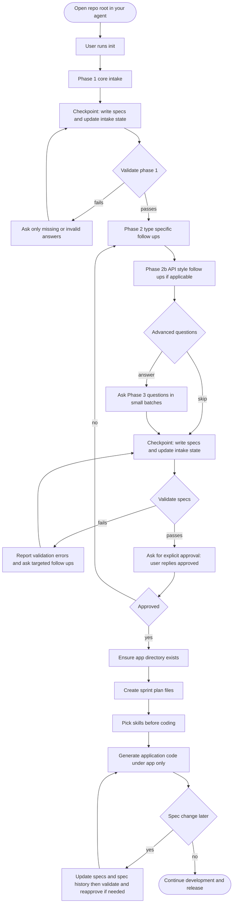

# Getting Started

This guide explains the end-to-end workflow in SDD Spine and shows how the intake, validation, approval gate, and post-approval skills fit together.

## The Workflow (Mermaid)

## Quick Checklist

1. Start intake: user types `init`.
2. Answer Phase 1 questions (Core).
3. Agent checkpoints by updating specs under `sdd/memory-bank/` and `sdd/memory-bank/core/intake-state.md`.
4. Agent validates (`sdd/.agent/rules/intake/02-validation.md`).
5. Continue Phase 2 / Phase 2b, optionally skip Phase 3.
6. When validation passes, agent asks for approval (reply `approved`).
7. After approval: code goes under `app/` only, and the agent selects a skill workflow.

## Key Files To Know
- Intake flow + questions:
  - `sdd/.agent/rules/intake/00-intake-flow.md`
  - `sdd/.agent/rules/intake/01-questions.md`
- Validation:
  - `sdd/.agent/rules/intake/02-validation.md`
- Resume:
  - `sdd/memory-bank/core/intake-state.md`
- Spec change tracking:
  - `sdd/memory-bank/core/spec-history.md`
- Post-approval skills:
  - `sdd/.agent/skills/USAGE.md`

## Common Mistakes
- Generating code before approval: not allowed (approval gate).
- Skipping validation: the agent should not ask for approval until validation passes.
- Changing a mandatory choice (stack/arch/API style) after approval without re-approval.
