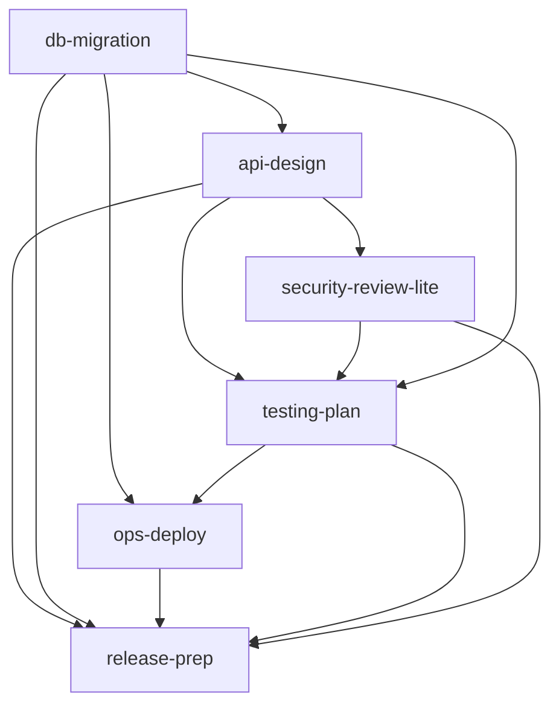

# Skills Dependency Graph (Suggested)

Arrows mean "often used together" or "often comes next".

- Visual reference: this file
- Canonical machine-readable source: `sdd/.agent/skills/dependency-map.tsv`

