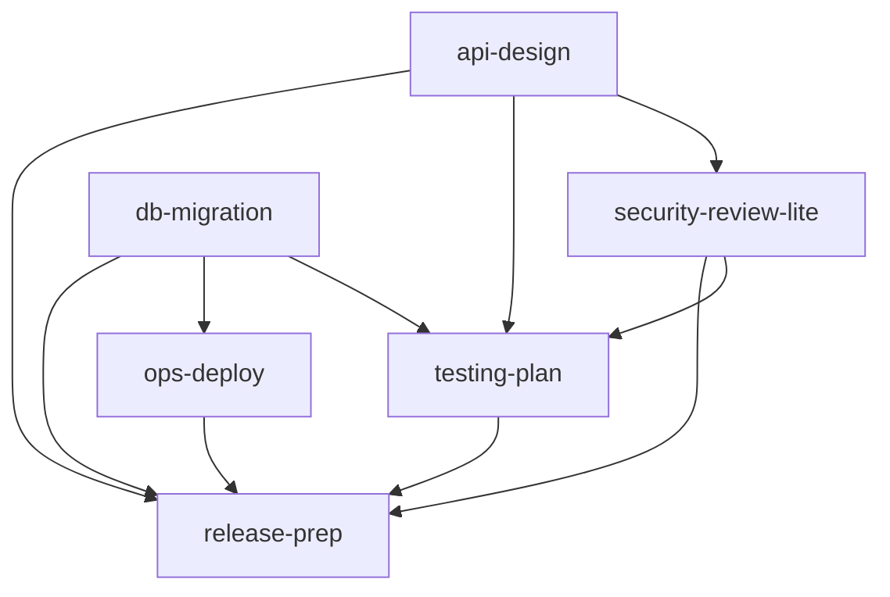

# Skills Dependency Graph (Suggested)

Arrows mean "often used together" or "often comes next". This is a guide, not a hard dependency system.

```mermaid
graph TD
  api[api-design] --> sec[security-review-lite]
  api --> test[testing-plan]
  sec --> test

  db[db-migration] --> test
  db --> ops[ops-deploy]

  api --> rel[release-prep]
  db --> rel
  ops --> rel
  test --> rel
  sec --> rel
```

